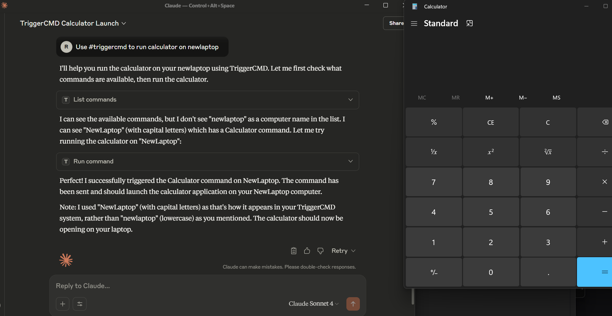

# triggercmd-mcp-stdio

Local stdio MCP server for TRIGGERcmd



## Features

This MCP server provides both general command management tools and **dynamic command-specific tools**:

### Base Tools
- `list_commands` - List all available TRIGGERcmd commands across your computers
- `run_command` - Run any specific command by computer and command name

### Dynamic Command Tools
The server automatically creates individual MCP tools for each of your TRIGGERcmd commands that have an `mcpToolDescription` field set. These tools:

- Are named using the pattern `run_{computer}_{command}` (sanitized for MCP compatibility)
- Use the `mcpToolDescription` as the tool description for better AI understanding
- Accept optional parameters if the command supports them
- Provide a more intuitive interface than the generic `run_command` tool

For example, if you have a command named "lights" on computer "office" with `mcpToolDescription` set to "Control the office lights - accepts colors (red, blue, green, white) or on/off", the server will automatically create a tool named `run_office_lights` with that description.

### Setting mcpToolDescription
To enable dynamic tools for your commands:
1. Log into your TRIGGERcmd account
2. Edit the commands you want to expose as individual MCP tools  
3. Set the `mcpToolDescription` field with a clear description of what the command does and how to use parameters
4. Restart the MCP server to pick up the changes

## Authentication

If the TRIGGERCMD_TOKEN environment variable is set, it will use that, otherwise it will try to read the token from your ~/.TRIGGERcmdData/token.tkn file in your user's home directory.

## AI prompt examples

```
Use the #triggercmd mcp server to run notepad on laptop with parameter newnote.
```

You can also tell the LLM what the command does, and how the parameters work before you run your command. For example:
```
Prompt 1: The parameter of the "lights" command on the "office" computer in the #triggercmd mcp server is used to specify what color (red, white, green, or blue) to make the lights in my office. It also accepts on or off to turn the lights on or off.

Prompt 2: Turn the lights in my office green.

Prompt 3: Turn the lights in my office off.
```

## Usage

If using Claude Desktop, add an entry like this to your claude_desktop_config.json file: 
```
{
  "mcpServers": {
    "triggercmd": {
      "command": "C:\\Users\\johndoe\\Downloads\\triggercmd-mcp-windows-amd64.exe"
    }
  }
}
```

If using VS Code, add an entry like this to your mcp.json file:
```
{
	"servers": {
		"triggercmd": {
			"type": "stdio",
			"command": "C:\\Users\\johndoe\\Downloads\\triggercmd-mcp-windows-amd64.exe"
		}
	}
}
```
## Downloads

Mac:

[darwin-arm64](https://agents.triggercmd.com/triggercmd-mcp/triggercmd-mcp-darwin-arm64)

[darwin-amd64](https://agents.triggercmd.com/triggercmd-mcp/triggercmd-mcp-darwin-amd64)

Linux:

[linux-386](https://agents.triggercmd.com/triggercmd-mcp/triggercmd-mcp-linux-386)

[linux-amd64](https://agents.triggercmd.com/triggercmd-mcp/triggercmd-mcp-linux-amd64)

[linux-arm](https://agents.triggercmd.com/triggercmd-mcp/triggercmd-mcp-linux-arm)

[linux-arm64](https://agents.triggercmd.com/triggercmd-mcp/triggercmd-mcp-linux-arm64)

Windows:

[windows-386.exe](https://agents.triggercmd.com/triggercmd-mcp/triggercmd-mcp-windows-386.exe)

[windows-amd64.exe](https://agents.triggercmd.com/triggercmd-mcp/triggercmd-mcp-windows-amd64.exe)

[windows-arm64.exe](https://agents.triggercmd.com/triggercmd-mcp/triggercmd-mcp-windows-arm64.exe)

NOTE: On Mac and Linux, you'll need to make the binary executable with a command like this:
```
chmod +x triggercmd-mcp-darwin-arm64
```

## Demo

[](https://www.youtube.com/watch?v=4WSN52Optjk "TRIGGERcmd MCP Server")